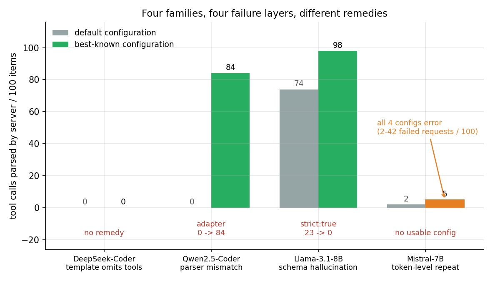
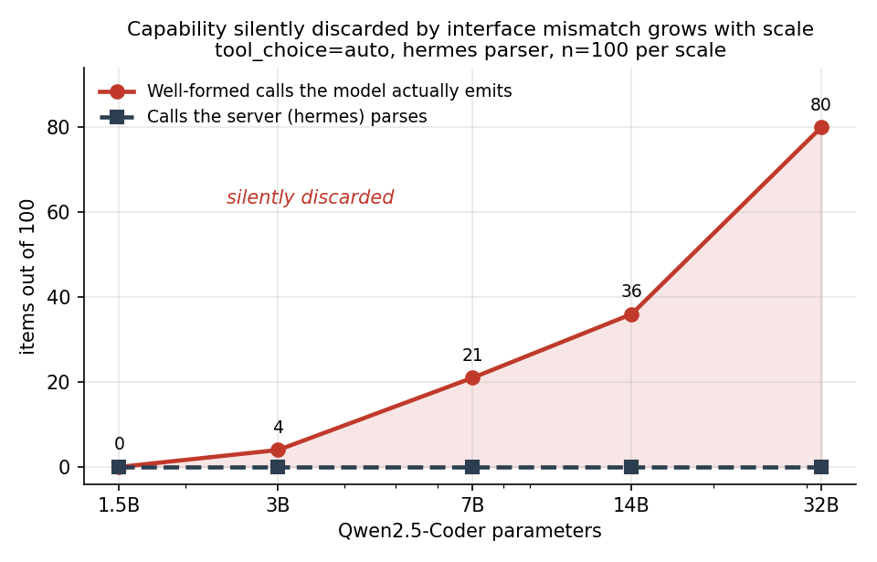
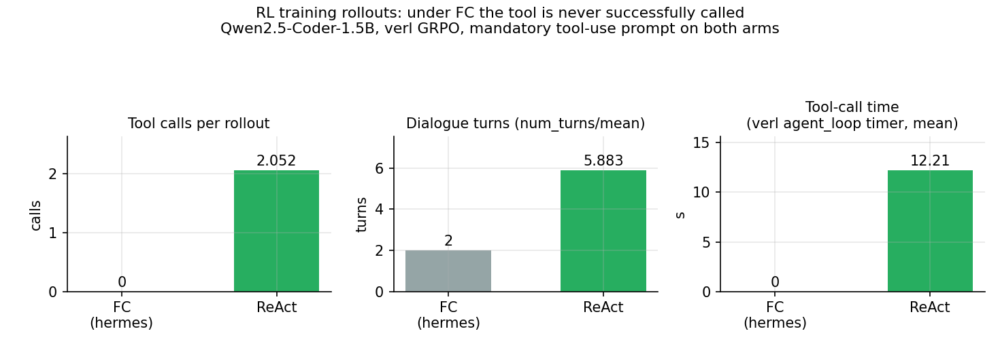

# 被静默藏掉的那部分随规模增长——并且一路穿透到策略梯度

**工具调用接口在下游看到任何东西之前，就已经把轨迹截断了**

> 本文档为顶层结论。完整证据、对照设计与措辞边界见
> [`writeup/section_config.md`](writeup/section_config.md)（11 节）；
> 数据勘误见 [`runs/final/ERRATA.md`](runs/final/ERRATA.md)；
> 图见 [`figures/`](figures/)。
>
> 上一版框架（"三层否定"）已被本工作自身推翻，保留于
> `internal/superseded/RESULTS_v1_refuted_20260829.md` 作为记录。

---

## 0. 一句话

在 vLLM 上按官方文档配置四个模型家族做 function calling 评测，**每个家族都会在不同层
静默失败**；失败表现为"模型不会用工具"，实则是接口错配。该错配同时污染了
**评测数字**与 **RL 训练信号**——在我们自己的训练中，它使工具调用在梯度上不可达。

## 1. 起点：一个训练结果里说不通的地方

Qwen2.5-Coder-1.5B，verl GRPO / RLOO，150 步 × 3 个独立 run，
保留测试集 EvalPlus（HumanEval+ 319 / MBPP+ 677，扣除 2 条已知缺陷题，分母 540 / 454）。

| run | multi 最终 | turn-1 | repair |
|---|---|---|---|
| GRPO seed42 | 64.8% → 67.6% (p=0.064) | +2.6% (p=0.093) | +4.6% (**p=0.030**) |
| GRPO seed1 | 64.3% → 67.0% (p=0.078) | +3.0% (p=0.053) | +3.7% (p=0.097) |
| RLOO seed42 | 64.6% → 67.2% (p=0.077) | +2.6% (p=0.082) | +0.9% (p=0.786) |

主效应 **p 在 0.06–0.08，按 0.05 并不显著**；可信度来自三个独立 run 方向一致、
幅度同为 +2.6~2.8%。

**真正的问题在分解里**：新通过的题中 **91–94% 是首轮就过的**；
靠第 2 轮及以后救回的题数，从 step 0 到 step 150 一直在 **6–9 / 540** 横盘。

> RL 提升的是初稿质量，多轮调试能力**完全没有变化**。

这构成本工作的出发点：**多轮为什么不动？**

## 2. 答案不在模型，在接口

用 100 道去污染后的 KodCode 题（全部实验共用同一题集，已核验唯一集合数 = 1）
逐个家族排查，得到四层互不相同的失败：



| 家族 | 失败层 | 表现 | 可修复性 |
|---|---|---|---|
| DeepSeek-Coder | 模板层 | chat template 根本不注入 tools | 无解（模板检查即可发现） |
| **Qwen2.5-Coder** | **parser 层** | 输出 ```json 而非 `<tool_call>`，服务端静默返回空数组 | ✅ 专用适配器 0 → 84 |
| **Llama-3.1-8B** | **schema 层** | 23% 幻觉调用**题目函数本身**而非 `run_tests` | ✅ `strict: true` 23 → 0 |
| **Mistral-7B** | **词元层** | 重复吐 `[TOOL_CALLS]` 触发 400 | ❌ 四种配置全部失败 |

**关键性质：只有 `--enable-auto-tool-choice` 缺失会硬报错，其余全部静默降级。**
服务照常返回 200，`tool_calls` 是空数组，下游只看到"模型没有调用工具"。

## 3. 静默低估随规模单调增长



Qwen2.5-Coder，`tool_choice=auto`，hermes parser（vLLM 文档对 Qwen2.5 的推荐配置），
1.5B → 32B 共 21 倍规模：

| 规模 | 服务端解析出 | 模型实际产出的合格调用 |
|---|---|---|
| 1.5B | 0 | 0 |
| 3B | 0 | 4 |
| 7B | 0 | 21 |
| 14B | 0 | 36 |
| **32B** | **0** | **80** |

"合格调用"判据严格：`{"name":"run_tests", "arguments":{"code":"<含真实 Python 的字符串字面量>"}}`，
排除 schema 回显与示意性伪代码。

> **模型越大，被静默丢弃的能力越多。** 32B 上 80/100 道题模型写出了完全可用的
> 工具调用，评测系统记录为"该模型从不使用工具"。

阳性对照排除了"配置坏了"：同一活跃服务上把 `tool_choice` 改为 `required`，
hermes 解析完全正常（函数名、`arguments`、`code` 全对）。
但该对照只证明**管线可用**，不证明模型自发会用——`required` 走受约束解码。

## 4. Llama 的失败经过四重对照才定性

最初观察：Llama-3.1-8B 在 FC 下 23% 的题里，把**题目要求实现的那个函数**当成工具调用，
参数填的是该函数的形参（`{"tiles":..., "word":...}`）。四个替代解释逐一排除：

| 替代解释 | 对照 | 空参数率 | 结论 |
|---|---|---|---|
| schema 参数缺描述 | rich vs terse | 23 → 22（p=1.000） | 排除 |
| ReAct 只是多了思考步骤 | FC + Thought 脚手架 | 23 → **59**（p<0.001，**反向恶化**） | 排除 |
| 服务端未按官方推荐配置 | + 官方 chat template | 23 → 22（p=0.125） | 排除 |
| **未启用 schema 约束** | **+ `strict: true`** | **23 → 0（p=0.0001）** | **成立** |

第四重推翻了前三重的结论。正确表述是：**模型确实存在角色混淆，
而 `strict: true` 通过受约束解码抑制了它**——缺陷真实存在，只在缺少约束时显形，
而 vLLM `auto` 模式默认不约束。

**本节自身即为论点的例证**：本工作带着明确怀疑、连做三个单变量对照，
仍把一个配置问题写成"模型能力缺陷"，直到第四个对照才发现。

## 5. 主表（统一配置）

全部真实 `max_tokens=2048`、同一 100 题、`temperature=0`：

| 模型 | ReAct 首轮 | ReAct 最终 | FC 首轮 | FC 最终 | b/c | p |
|---|---|---|---|---|---|---|
| Llama-3.1-8B | 61 | **80** | 46 | 61 | 27/8 | **0.0019** |
| Qwen2.5-Coder-7B | 57 | **74** | 53 | 62 | 17/5 | **0.0169** |
| Mistral-7B-v0.3 | 26 | 33 | N/A | N/A | N/A | N/A |

Mistral 的四种 FC 配置**全部含请求错误**（2 / 42 / 3 / 39），含缺失数据的臂
不计算通过率与 p 值。正确表述不是"两协议无差别"，而是
**Mistral 在 FC 下无法产出一份无错误的 100 题数据**。

**接口修好后协议差距依然存在**，且两个家族一致。

## 6. 闭环：换对适配器能拿回多少

Qwen2.5-Coder-7B，同 100 题，`tool_choice=auto` 固定，只换适配器组合：

| 臂 | 解析出 | 平均轮数 | ≥2 轮 | 首轮通过 | 最终通过 | 多轮救回 |
|---|---|---|---|---|---|---|
| ReAct | 95 | 1.92 | 40 | 57 | **74** | 17 |
| FC + hermes | **0** | 0.96 | **0** | 53 | 53 | **0** |
| FC + 专用适配器 | **84** | 1.82 | **37** | 53 | **62** | **9** |

**机制全部恢复**（解析 0→84、多轮 0→37、救回 0→9）；
**通过率只回收一部分**（53→62，p=0.093，未达显著）。

**内部效度检验**：两个 FC 臂**首轮通过完全相同（53 vs 53）**——
适配器只影响第一轮之后发生什么，数据正是如此。

## 7. 训练侧：接口错配使工具调用在梯度上不可达



同模型、同数据、同超参、同 seed，**两侧 prompt 强度对齐**
（FC 用 mandatory 版："**你必须先调用 run_tests 工具验证你的代码**"）：

| 臂 | 步数 | num_turns/mean | 工具耗时 | 每 rollout 工具调用 |
|---|---|---|---|---|
| FC（tool_agent + hermes） | 10 | **2.000** 恒定 | **0.00 s** | **0.000** |
| ReAct（react_agent） | 3 | 5.883 | 12.21 s | **2.052** |

计数插桩在 `CodeTool.execute` 与 `ReActAgentLoop._run_tests` 两个 agent 侧调用点
（**不能在 `sandbox.run_tests` 计数**——奖励函数评测最终代码也走该函数）。

**措辞边界**：测得的是 **parser 接受并执行的调用为 0**，不是"模型从未尝试"。
以相同 mandatory prompt 在同一 1.5B 上做探针复刻（n=100）：
**0 条合格调用、54 条直接作答、46 条无法解析、66 条含 JSON 片段但无一写出 `"name":"run_tests"`**。

### 冷启动

有效调用**从第 1 步起就是 0**，而奖励允许直接输出代码得分。于是策略梯度里
**不存在任何把策略推向工具调用的信号**——工具路径回报恒为零样本。
**强制性 prompt 加 GRPO 不足以跨过这个冷启动**：模型无法通过探索发现工具路径，
因为每次尝试都在协议层被丢弃，从未产生过一条带正回报的工具轨迹供强化。

> **接口错配使某条策略分支在优化过程中不可达。**

### 完整因果链

```
Qwen2.5-Coder-1.5B（受训模型）不产出 hermes 可解析的调用
  （§7 探针复刻，同 mandatory prompt：解析 0/100，严判据合格调用 0/100，
   66/100 含 JSON 片段但无一写出 "name":"run_tests"）
  → 训练 rollout 中 parser 接受的调用为 0（§7：num_turns 恒为 2）
    → Observation 永不回流，轨迹退化为单轮
      → RL 只能在单轮信号上优化
        → §1：多轮救回横盘 6–9/540，新通过题 91–94% 为首轮即过
```

**限定**：成立于 Qwen2.5-Coder + hermes 这一具体组合，不可泛化为"所有 FC 训练"。

## 8. 采样方差

Llama-3.1-8B，`temperature=0.6`，n=100 × 3 seed：

| | seed 1 | seed 2 | seed 3 | 有效臂 |
|---|---|---|---|---|
| ReAct 最终 | 72 | 72 | 72 | 3/3 |
| FC 最终 | 62 | 66 | ~~57~~ | **2/3** |

FC seed 3 含 1 条并行工具调用被 vLLM 拒收（官方文档载明 Llama 3 不支持并行调用），
按规则记为无效；FC 仅 2 个有效臂，**不报标准差**，只给区间 [62, 66]。
最坏情况 ReAct 72 vs FC 66 = **+6**，方向在全部有效重复中一致。

**噪声结构相反**：ReAct 首轮 43–56（sd 6.8）而最终收敛；FC 首轮 44–45（sd 0.58）
而最终发散。机制在救回数的反向补偿（19 / 16 / **29**）。

**必须的限定**：三次最终值同为 72 是**总数的巧合**——三个 seed 的通过集合两两
Jaccard 仅 0.71–0.80，题目级差异 15–24 道。
**不可表述为"ReAct 结果完全稳定"**，准确说法是
**多轮修复吸收了首轮采样噪声，使总量稳定而成分仍在变动**。

## 9. 与在先工作的关系

Qwen2.5-Coder 不产出 hermes 格式这一现象，**hanXen 于 2026-01-23 已在
vLLM issue #32926 报告**并提出 `<tools>` 方案，该 issue 已被 close as not planned
（标签 stale）——**该陷阱至今仍然生效**。

本工作的增量不在于发现该现象，而在于：
①在 21 倍规模上量化它偷走多少；②区分"模型意图 / 文本格式 / 服务端解析 / 实际执行 /
多轮救回"五个层次；③给出四家族失败分层；④证明它同样污染 RL 训练信号；
⑤给出闭环（换适配器恢复多少）。

## 10. 局限

1. 单一题库（KodCode 子集）、每臂 100 题、**`clean[:100]` 非随机取样**
2. 主表为 `temperature=0` 单次采样；方差仅在 Llama-3.1-8B 上估计，且 FC 仅 2 个有效臂
3. 十余次 McNemar **未做多重比较校正**；主效应（1e-3 量级）可过 Bonferroni，
   边缘结果（p=0.093 / 0.125）不可
4. 专用适配器同时更换 **parser、chat template 与 few-shot 三者**，只能称"适配器组合"，
   不能单独归因于 parser；模板 × parser 的 2×2 消融未做
5. 模型规模止于 32B，无前沿模型
6. 训练侧仅 10 步 / 3 步的机制演示，**未做 150 步的效果对比**
7. 数据勘误（7 个臂 provenance 记录错误、5 个臂通过率不可比）见 `ERRATA.md`

## 11. 复现

```bash
# 探针（协议层）
python probe_react_full.py --model <path> --port 8000 --n 100 \
  --protocol {react,fc} --strength {optional,mandatory} \
  --fc-schema {terse,rich,strict} --parser-adapter cross_family \
  --temperature 0.0 --out traj.jsonl

# 逐臂严格验收（行数 / rc / n_err / provenance / 脚本 hash）
python validate_arms.py

# 主表与方差表（含缺失数据的臂自动标 N/A，拒绝计算）
python runs/final/final_table.py

# 三张主图
python figures/make_figs.py
```
**注意口径**：上式首环用的是**受训模型 1.5B** 的数值。§3 那条升到 80/100 的曲线是**跨规模现象**（32B），不可代入本训练的因果链——1.5B 在严判据下合格调用为 0。


训练线复现见 `analyze_all.py`（报告中全部 EvalPlus 数字的唯一来源）。
